<div align="center">

<a href="README.en.md"></a>
<a href="README.vi.md"></a>
<a href="README.md"></a>

<br/><br/>


<br/>

<a href="https://github.com/VuDoanDungVN">
  
</a>

<br/>

<a href="https://www.youtube.com/@vudungdev"></a>
<a href="https://www.blendervn.com"></a>
<a href="https://github.com/VuDoanDungVN"></a>

</div>


## About Me

I'm a backend-leaning full-stack engineer based in Japan, working across mobile, desktop, and the systems behind them. I like taking a product from an idea to something people can actually install and use — mobile apps in Flutter and React Native, native tools in C#, and Python when a problem is better solved with a script than a service.

Most of my recent work sits at the intersection of **mobile development and system design**: building the client, the API behind it, and making sure both hold up under real users.

<table>
<tr>
<td width="60%" valign="top">

```
🔭  Currently building   mobile & desktop apps backed by
                          systems I design end-to-end

🌱  Currently sharpening  system design & backend architecture

💡  Interested in        developer tooling, automation, and
                          making apps feel native regardless
                          of framework

📺  Sharing progress     youtube.com/@vudungdev
```

</td>
<td width="40%" valign="top">

</td>
</tr>
</table>


## Tech Stack

**Languages**


**Mobile & Frontend**


**Tools & Platforms**


## Contribution Snake

<div align="center">
<picture>
  <source media="(prefers-color-scheme: dark)" srcset="https://raw.githubusercontent.com/VuDoanDungVN/VuDoanDungVN/output/github-contribution-grid-snake-dark.svg" />
  <source media="(prefers-color-scheme: light)" srcset="https://raw.githubusercontent.com/VuDoanDungVN/VuDoanDungVN/output/github-contribution-grid-snake.svg" />
  
</picture>
</div>


## Connect With Me

<div align="center">

<a href="https://www.youtube.com/@vudungdev"></a>
<a href="https://www.blendervn.com"></a>
<a href="https://github.com/VuDoanDungVN"></a>
<!-- Add your own email/LinkedIn badges here once you decide which address to make public, e.g.: -->
<!-- <a href="mailto:YOUR_EMAIL"></a> -->
<!-- <a href="YOUR_LINKEDIN_URL"></a> -->

</div>


<div align="center">

<sub>Built it, shipped it, and if it broke, I probably already know.</sub>

<br/><br/>


</div>
